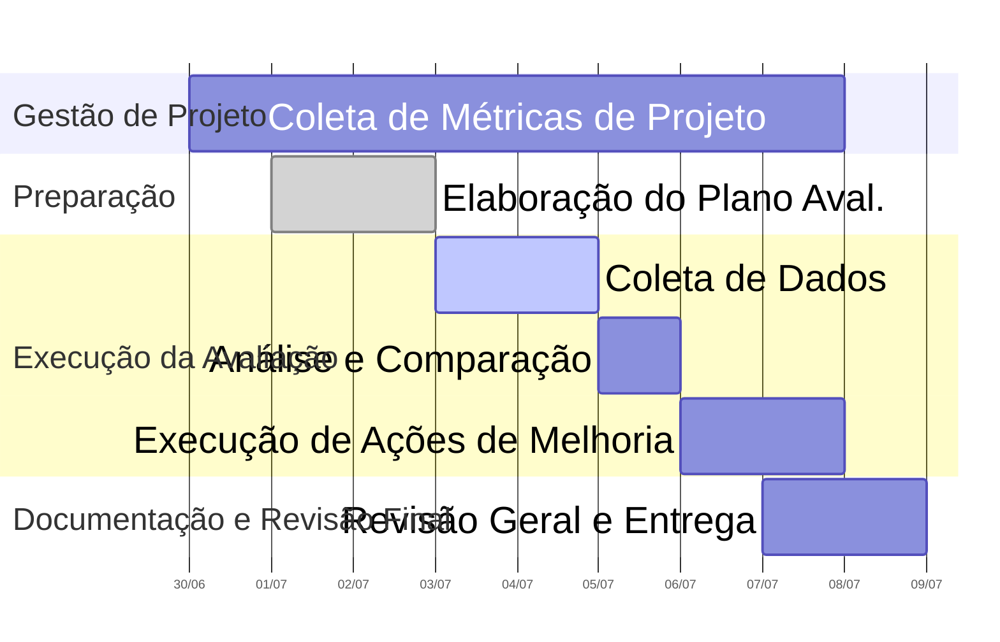

# Plano de avaliação do AgroMart

## Objetivo da avaliação

Avaliar o software AgroMart com base nas características de qualidade usando o método PSM-CID, quanto à **efetividade, eficiência e satisfação** e à **manutenibilidade**.

## Método de avaliação (PSM-CID)

- Características avaliadas:

| Característica       | Subcaracterística                                                             | Objetivo no AgroMart                                                                                         |
| -------------------- | ----------------------------------------------------------------------------- | ------------------------------------------------------------------------------------------------------------ |
| **Manutenibilidade** | Modularidade, Reusabilidade, Analisabilidade, Modificabilidade, Testabilidade | Avaliar a facilidade de localizar erros e fazer modificações no código ou interface                          |
| **Efetividade**      | Efetividade                                                                   | Assegurar que o sistema permita aos usuários completar suas tarefas corretamente e integralmente             |
| **Eficiência**       | Eficiência                                                                    | Garantir que o sistema utilize os recursos de forma otimizada para atingir os objetivos com o mínimo esforço |
| **Satisfação**       | Utilidade, Conforto, Prazer, Confiança                                                                    | Avaliar a percepção positiva dos usuários quanto à experiência geral com o sistema                           |

- Métricas definidas (Manutenibilidade):

| Código | Métrica                    | Como medir                                                                                            |
| ------ | -------------------------- | ----------------------------------------------------------------------------------------------------- |
| M1     | Grau de acoplamento        | Análise estática do código usando ferramentas como Dependency Cruiser para medir AC, EC e Instability |
| M2     | Cobertura da documentação  | Densidade de comentários (Comment Lines Density) medida com SonarQube                                 |
| M3     | Duplicação de código       | Percentual de código duplicado detectado por ferramentas como SonarQube                               |
| M4     | Cobertura de testes        | Percentual de código coberto por testes automatizados, medido com Jest                                |
| M5     | Complexidade ciclomática   | Cálculo da complexidade ciclomática por função com SonarQube                                          |
| M6     | Tempo para entender módulo | Derivado da complexidade cognitiva calculada pelo SonarQube, representando esforço mental necessário  |

- Métricas definidas (efetividade, eficiência e satisfação):

| Código | Métrica                     | Tipo         | Como medir                                                                                     |
| ------ | --------------------------- | ------------ | ---------------------------------------------------------------------------------------------- |
| M7     | Taxa de sucesso nas tarefas | Quantitativa | Porcentagem de tarefas realizadas com sucesso sem necessidade de retrabalho                    |
| M8     | Tempo de execução da tarefa | Quantitativa | Cronometrar o tempo médio que um usuário leva para realizar tarefas comuns                     |
| M9     | Satisfação média            | Qualitativa  | Questionário com escala Likert (1 a 5) aplicado aos usuários após execução das tarefas         |
| M10    | Tempo de resposta percebido | Qualitativa  | Avaliação subjetiva do usuário sobre a velocidade do sistema, com questionários ou entrevistas |

## Guia do avaliador

- Parte 1 - Avaliação da usabilidade (com usuários)
  - Preparação:
    - Configure o ambiente de teste do AgroMart
    - Indique a funcionalidade que deseja que o usuário tente realiza
    - Tenha um cronômetro e folha de registro por avaliador
  - Executar as tarefas executadas:
    - Definir as funcionalidades que cada usuário vai realizar e colocar em prática
  - Durante a execução das tarefas:
    - Cronometre o tempo por tarefa
    - Anote os erros cometidos
    - Observe comentários espontâneos do usuário, e anote aquilo que achar relevante
    - Não interfira se não for solicitadoo pelo usuário
  - Pós uso:
    - Implementar o questionário de satisfação com uma escala de 1 (discordo totalmente) a 5 (concordo totalmente)
    - O sistema foi de fácil navegação?
    - Encontrei o que eu proucurava sem dificuldade?
    - A interface te deixou confortável para utilizar o sistema?
    - Sentiria confortável em utilizar esse sistema com frequência?
- Parte 2 - Avaliação da Manutenibilidade (com desenvolvedores)
  - Revisão de código:
    - Escolha um módulo real
    - Olhar o lançamento de funcionalidade e analisar o tempo para abrirem commits de _fixup_ ou _refactor_, identificando a detecção de erro e lançamento dessas funcionalidades para ver o tempo de corrigir esses erros.
  - Checklists de boas práticas:
    - O código possui nomes descritivos para classes, variáveis e funções?
    - Existe documentação mínima no código?
    - O código está dividido em funções/módulos reutilizáveis?
    - Há testes automatizados?
    - O código tem dependências fortemente acopladas?

## Recursos

### Divisão de Subgrupos

Para otimizar a execução da avaliação e considerando as ênfases estabelecidas (manutenibilidade: 5, efetividade, eficiência e satisfação: 2), a equipe foi dividida em dois subgrupos de trabalho, atuando de forma paralela e coordenada.

---

#### Subgrupo Manutenibilidade (3 pessoas)

**Integrantes**: Cássio Reis, Gabriel Bertolazi, Letícia Paiva

**Foco**: Ênfase na avaliação dos aspectos de manutenibilidade do software.

**Responsabilidades**:

- Planejar e executar a coleta de dados de manutenibilidade, utilizando as ferramentas e técnicas apropriadas (incluindo o Q-Rapids).
- Analisar os dados coletados e compará-los com os critérios de manutenibilidade previamente definidos.
- Propor ações de melhoria específicas para a manutenibilidade do Agromart.
- Documentar todas as descobertas, análises e propostas de melhoria.

---

#### Subgrupo de Efetividade, Eficiência e Satisfação (2 pessoas)

**Integrantes**: Daniel Santos, Philipe Barros

**Foco**: Ênfase na avaliação dos aspectos de qualidade em uso do software relacionados à efetividade, eficiência e satisfação.

**Responsabilidades**:

- Planejar e executar a coleta de dados de efetividade, eficiência e satisfação, empregando métodos como testes de usuário, questionários ou avaliações heurísticas.
- Analisar os dados coletados e compará-los com os critérios previamente definidos.
- Propor melhorias na interface ou nos fluxos de interação do AgroMart.
- Documentar todas as descobertas, análises e propostas de melhoria.

---

### Ferramentas

A seguir, são listadas as ferramentas e recursos que podem ser utilizados durante a avaliação do sistema AgroMart. O uso de cada ferramenta dependerá da necessidade e estratégia definida pelos subgrupos.

| Ferramenta                                    | Finalidade                                                               |
| --------------------------------------------- | ------------------------------------------------------------------------ |
| **Q-Rapids**                                  | Análise contínua da qualidade do software, com foco em manutenibilidade. |
| **Planilhas (Excel/Google Sheets)**           | Tabulação e cálculo de métricas quantitativas.                           |
| **Formulários/Testes de usuário**             | Coleta de dados qualitativos e quantitativos de usabilidade.             |
| **Editores Markdown (MkDocs)**                | Documentação estruturada do plano, resultados e recomendações.           |
| **Editores de código (VS Code, IntelliJ)**    | Aplicação de melhorias no código-fonte.                                  |
| **Ferramentas de prototipagem (Figma, etc.)** | Representação visual de sugestões de interface.                          |
| **Git/GitHub**                                | Controle de versão e rastreabilidade das mudanças no projeto.            |

## Cronograma

O cronograma a seguir apresenta a distribuição das atividades do grupo. Cada atividade possui responsáveis e prazos definidos.

| **Categoria**                    | **Atividade Principal**          | **Período**               | **Responsáveis** |
| -------------------------------- | -------------------------------- | ------------------------- | ---------------- |
| **Gestão de Projeto**            | Gerenciamento contínuo           | 30 de junho a 07 de julho | Grupo completo   |
| **Preparação**                   | Elaboração do Plano de Avaliação | 01 a 02 de julho          | Grupo completo   |
| **Execução da Avaliação**        | Coleta de dados                  | 03 a 04 de julho          | Subgrupos        |
|                                  | Análise e comparação             | 05 de julho               | Subgrupos        |
|                                  | Execução de ações de melhoria    | 06 a 07 de julho          | Grupo completo   |
| **Documentação e Revisão Final** | Revisão geral e entrega          | 07 a 08 de julho          | Grupo completo   |

O gráfico Gantt abaixo oferece uma visualização clara da sequência e duração das atividades previstas:

## Histórico de Versão

| Versão | Data       | Autor                                             | Descrição                       | Revisor |
| ------ | ---------- | ------------------------------------------------- | ------------------------------- | ------- |
| 1.0    | 01/07/2025 | [Gabriel Bertolazi](https://github.com/Bertolazi) | Criação do documento            | -       |
| 1.1    | 02/07/2025 | [Cássio Reis](https://github.com/csreis72)        | Adição de Recursos e Cronograma | -       |
