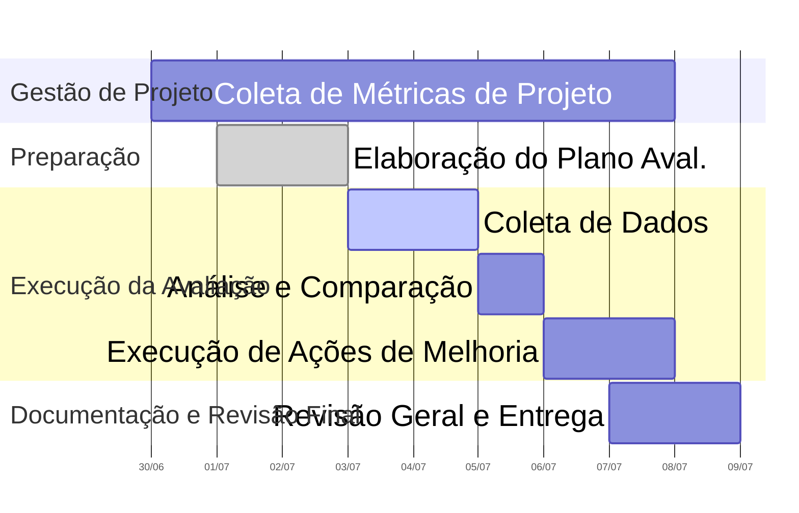

# Plano de avaliação do AgroMart

## Objetivo da avaliação

Avaliar o software AgroMart com base nas características de qualidade usando o método PSM-CID, quanto à **usabilidade** e à **manutenibilidade**.

## Método de avaliação (PSM-CID)

- Características avaliadas:

| Característica       | Subcaracterística                                                             | Objetivo no AgroMart                                                                |
| -------------------- | ----------------------------------------------------------------------------- | ----------------------------------------------------------------------------------- |
| **Usabilidade**      | Operacionalidade, Aprendizado, Estética, Acessibilidade                       | Garantir que o sistema seja intuitivo, claro e fácil de usar                        |
| **Manutenibilidade** | Modularidade, Reusabilidade, Analisabilidade, Modificabilidade, Testabilidade | Avaliar a facilidade de localizar erros e fazer modificações no código ou interface |

- Métricas definidas:

| Métrica                                  | Tipo         | Como medir                                                                                                                                |
| ---------------------------------------- | ------------ | ----------------------------------------------------------------------------------------------------------------------------------------- |
| Tempo médio para completar tarefa        | Quantitativa | Cronometrar quanto tempo um colega demora para realizar tarefas comuns                                                                    |
| Número de erros por tarefa               | Quantitativa | Quantidade de tentativas incorretas ou falhas                                                                                             |
| Satisfação do usuário                    | Qualitativa  | Questionário com escala Likert (1 a 5) (aplicado ao colega que realizou as tarefas)                                                       |
| Tempo para localizar/modificar módulo    | Quantitativa | Ver quando uma tarefa foi feita e quando ela foi refatorada, ou corrigida, pretendemos verificar isso por meio das linguagens dos commits |
| Facilidade de leitura do código          | Qualitativa  | Checklist técnico: nomes, comentários, organização                                                                                        |
| Cobertura de testes                      | Quantitativa | Percentual de código coberto por testes automatizados                                                                                     |
| Grau de acoplamento entre módulos        | Quantitativa | Análise estática do código (ex.: número de dependências entre módulos/classes/funções)                                                    |
| Cobertura da documentação                | Quantitativa | Verificar a presença e completude de documentos essenciais (manuais, guias, etc.), comparando contra uma lista de documentos esperados    |
| Complexidade ciclomática                 | Quantitativa | Cálculo da complexidade por meio de ferramentas como SonarQube                                                                            |
| Taxa de sucesso em tarefas               | Quantitativa | Porcentagem de tarefas realizadas com sucesso sem necessidade de retrabalho                                                               |
| Desempenho percebido (tempo de resposta) | Qualitativa  | Avaliação subjetiva do usuário sobre a velocidade do sistema, por meio de questionários ou entrevistas                                    |

## Guia do avaliador

- Parte 1 - Avaliação da usabilidade (com usuários)
  - Preparação:
    - Configure o ambiente de teste do AgroMart
    - Indique a funcionalidade que deseja que o usuário tente realiza
    - Tenha um cronômetro e folha de registro por avaliador
  - Executar as tarefas executadas:
    - Definir as funcionalidades que cada usuário vai realizar e colocar em prática
  - Durante a execução das tarefas:
    - Cronometre o tempo por tarefa
    - Anote os erros cometidos
    - Observe comentários espontâneos do usuário, e anote aquilo que achar relevante
    - Não interfira se não for solicitadoo pelo usuário
  - Pós uso:
    - Implementar o questionário de satisfação com uma escala de 1 (discordo totalmente) a 5 (concordo totalmente)
    - O sistema foi de fácil navegação?
    - Encontrei o que eu proucurava sem dificuldade?
    - A interface te deixou confortável para utilizar o sistema?
    - Sentiria confortável em utilizar esse sistema com frequência?
- Parte 2 - Avaliação da Manutenibilidade (com desenvolvedores)
  - Revisão de código:
    - Escolha um módulo real
    - Olhar o lançamento de funcionalidade e analisar o tempo para abrirem commits de _fixup_ ou _refactor_, identificando a detecção de erro e lançamento dessas funcionalidades para ver o tempo de corrigir esses erros.
  - Checklists de boas práticas:
    - O código possui nomes descritivos para classes, variáveis e funções?
    - Existe documentação mínima no código?
    - O código está dividido em funções/módulos reutilizáveis?
    - Há testes automatizados?
    - O código tem dependências fortemente acopladas?

## Recursos

### Divisão de Subgrupos

Para otimizar a execução da avaliação e considerando as ênfases estabelecidas (manutenibilidade: 5, usabilidade: 3), a equipe foi dividida em dois subgrupos de trabalho, atuando de forma paralela e coordenada.

---

#### Subgrupo Manutenibilidade (3 pessoas)

**Integrantes**: Cássio Reis, Gabriel Bertolazi, Letícia Paiva

**Foco**: Ênfase na avaliação dos aspectos de manutenibilidade do software.

**Responsabilidades**:

- Planejar e executar a coleta de dados de manutenibilidade, utilizando as ferramentas e técnicas apropriadas (incluindo o Q-Rapids).
- Analisar os dados coletados e compará-los com os critérios de manutenibilidade previamente definidos.
- Propor ações de melhoria específicas para a manutenibilidade do Agromart.
- Documentar todas as descobertas, análises e propostas de melhoria.

---

#### Subgrupo Usabilidade (2 pessoas)

**Integrantes**: Daniel Santos, Philipe Barros

**Foco**: Ênfase na avaliação dos aspectos de usabilidade do software.

**Responsabilidades**:

- Planejar e executar a coleta de dados de usabilidade, empregando métodos como testes de usuário, questionários ou avaliações heurísticas.
- Analisar os dados coletados e compará-los com os critérios de usabilidade previamente definidos.
- Propor melhorias na interface ou nos fluxos de interação do AgroMart.
- Documentar todas as descobertas, análises e propostas de melhoria.

---

### Ferramentas

A seguir, são listadas as ferramentas e recursos que podem ser utilizados durante a avaliação do sistema AgroMart. O uso de cada ferramenta dependerá da necessidade e estratégia definida pelos subgrupos.

| Ferramenta                                    | Finalidade                                                               |
| --------------------------------------------- | ------------------------------------------------------------------------ |
| **Q-Rapids**                                  | Análise contínua da qualidade do software, com foco em manutenibilidade. |
| **Planilhas (Excel/Google Sheets)**           | Tabulação e cálculo de métricas quantitativas.                           |
| **Formulários/Testes de usuário**             | Coleta de dados qualitativos e quantitativos de usabilidade.             |
| **Editores Markdown (MkDocs)**                | Documentação estruturada do plano, resultados e recomendações.           |
| **Editores de código (VS Code, IntelliJ)**    | Aplicação de melhorias no código-fonte.                                  |
| **Ferramentas de prototipagem (Figma, etc.)** | Representação visual de sugestões de interface.                          |
| **Git/GitHub**                                | Controle de versão e rastreabilidade das mudanças no projeto.            |

## Cronograma

O cronograma a seguir apresenta a distribuição das atividades do grupo. Cada atividade possui responsáveis e prazos definidos.

| **Categoria**                    | **Atividade Principal**                          | **Período**               | **Responsáveis**                         |
| -------------------------------- | ------------------------------------------------ | ------------------------- | ---------------------------------------- |
| **Gestão de Projeto**            | Gerenciamento contínuo                           | 30 de junho a 07 de julho | Grupo completo                           |
| **Preparação**                   | Elaboração do Plano de Avaliação                 | 01 a 02 de julho          | Grupo completo                           |
| **Execução da Avaliação**        | Coleta de dados (manutenibilidade e usabilidade) | 03 a 04 de julho          | Subgrupos Manutenibilidade e Usabilidade |
|                                  | Análise e comparação                             | 05 de julho               | Subgrupos Manutenibilidade e Usabilidade |
|                                  | Execução de ações de melhoria                    | 06 a 07 de julho          | Grupo completo                           |
| **Documentação e Revisão Final** | Revisão geral e entrega                          | 07 a 08 de julho          | Grupo completo                           |

O gráfico Gantt abaixo oferece uma visualização clara da sequência e duração das atividades previstas:

## Histórico de Versão

| Versão | Data       | Autor                                             | Descrição                       | Revisor |
| ------ | ---------- | ------------------------------------------------- | ------------------------------- | ------- |
| 1.0    | 01/07/2025 | [Gabriel Bertolazi](https://github.com/Bertolazi) | Criação do documento            | -       |
| 1.1    | 02/07/2025 | [Cássio Reis](https://github.com/csreis72)        | Adição de Recursos e Cronograma | -       |
