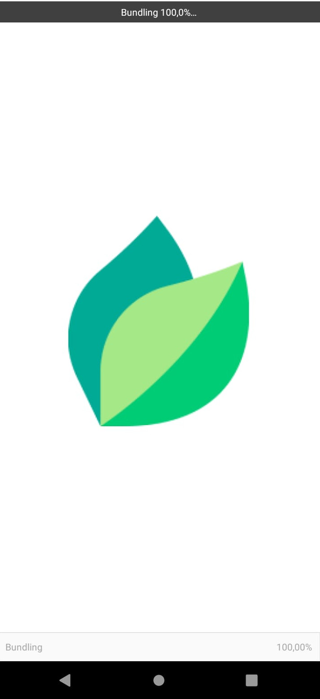
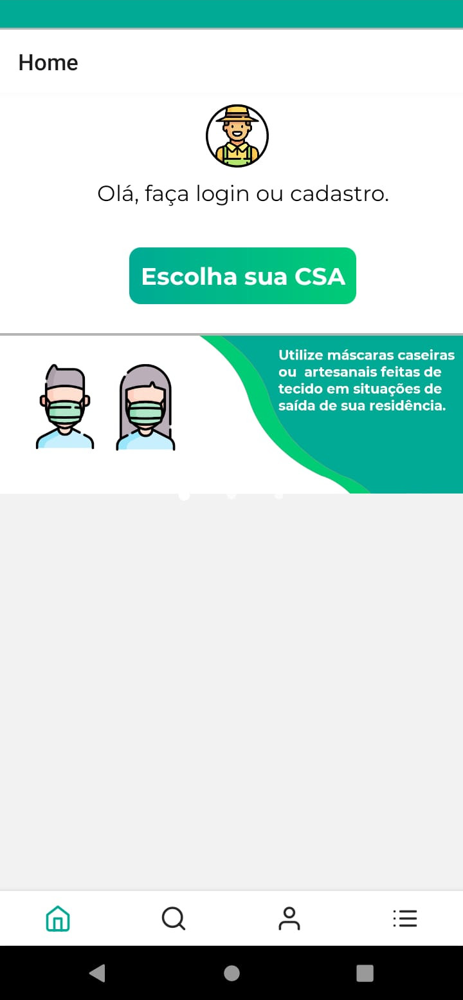
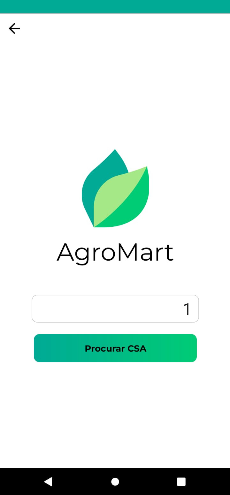
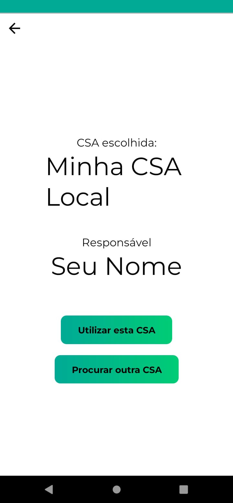
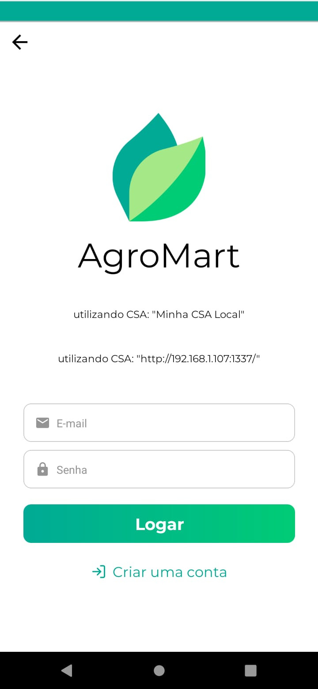
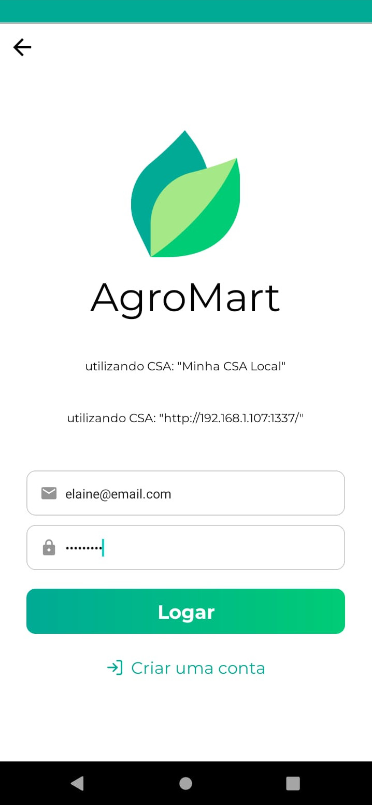
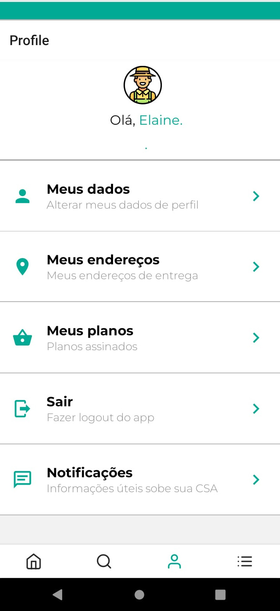
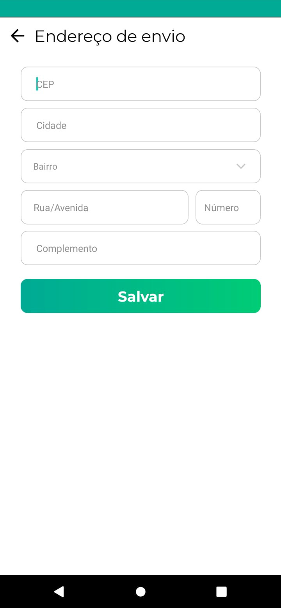
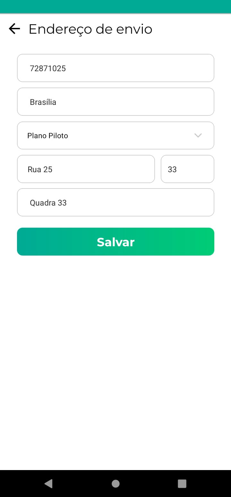

# Coleta de dados de efetividade, eficiência e satisfação - AgroMart

## Participante
- Nome: Elaine
- Perfil: Usuária iniciante em sistemas de marketplace
- Data da avaliação: 07/07/2025
- Ambiente: Celular Android + backend local em rede Wi-Fi

---

## Parte 1: Preparação

### Tarefas propostas
1. Entrar no AgroMart, selecionar uma CSA e realizar login.
2. Navegar até os dados de endereço e atualizar as informações.

### Ferramentas utilizadas
- Cronômetro do celular
- Observação direta e anotação em papel
- Registro de telas por printscreen durante o uso

---

## Parte 2: Execução das Tarefas

### Tarefa 1: Entrar no AgroMart, escolher CSA e logar

**Descrição da tarefa:**  
Usuária deve abrir o aplicativo AgroMart, escanear ou digitar o código da CSA previamente cadastrada e fazer login com seu e-mail e senha.

**Tempo gasto:** Aproximadamente 35 segundos  
**Erros cometidos:** Nenhum  
**Comentários:**  
> “Foi tranquilo, como o e-mail e senha já estavam cadastrados, foi só colocar e entrar.” 

**Prints da execução:**

  

    
    
<em>Carregando AgroMart</em>

  

  

    
    
<em>Tela Inicial</em>

  

  

    
    
<em>Tela de escolha da CSA</em>

  

  

    
    
<em>Tela de selecionar CSA</em>

  

   

    
    
<em>Tela login</em>

  

   

    
    
<em>Tela de login preenchida</em>

  

   

    
    
<em>Tela inicial após login</em>

  

    

---

### Tarefa 2: Atualizar dados de endereço

**Descrição da tarefa:**  
Usuária deve acessar a seção de dados pessoais, localizar o endereço e atualizar campos como CEP, complemento, cidade ou número.

**Tempo gasto:** Aproximadamente 40 segundos  
**Erros cometidos:** Nenhum  
**Comentário:**   
> “Foi facil de escolher a cidade.”

**Prints da execução:**  

   

    
    
<em>Tela inicial após login</em>

  

   

    
    
<em>Tela de atualizar dados do endereço</em>

  

  

    
    
<em>Endereço preenchido</em>

  

  

---

## Parte 3: Pós-uso - Questionário de Satisfação

**Escala: 1 (Discordo totalmente) a 5 (Concordo totalmente)**

| Questão                                                                 | Nota |
|------------------------------------------------------------------------|------|
| O sistema foi de fácil navegação?                                     | 5    |
| Encontrei o que procurava sem dificuldade?                            | 5    |
| A interface te deixou confortável para utilizar o sistema?            | 4    |
| Sentiria confortável em utilizar esse sistema com frequência?         | 4    |

---

## Observações Finais

- A participante concluiu todas as tarefas sem erros ou frustrações.
- Tempo total de execução: um pouco mais de 1 minuto.
- Interface considerada amigável e direta, com menus autoexplicativos.
- Pontos de melhoria mencionados: talvez adicionar dicas visuais sobre onde clicar no primeiro acesso.

---

## Histórico de Versão

| Versão | Data       | Autor                                              | Descrição                                | Revisor                                            |
| ------ | ---------- | -------------------------------------------------- | ---------------------------------------- | -------------------------------------------------- |
| 1.0    | 07/07/2025 | [Philipe Sousa](https://github.com/PhilipeSousa)         | Criação do documento                     | [Daniel Coimbra](https://github.com/DanielCoimbra) |
| 2.0    | 07/07/2025 | [Philipe Sousa](https://github.com/PhilipeSousa)         | Coleta de dados                     | [Daniel Coimbra](https://github.com/DanielCoimbra) |
