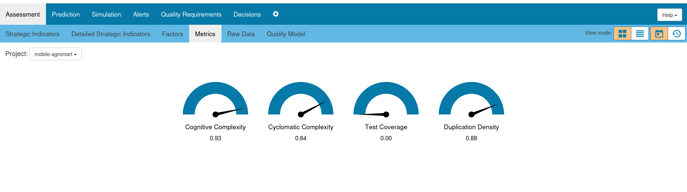
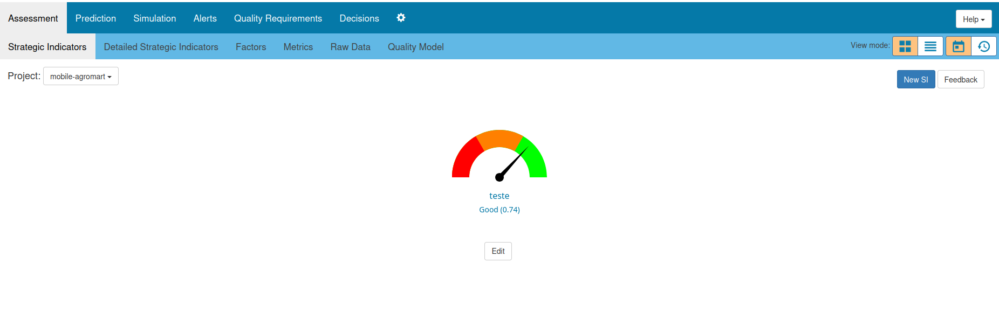
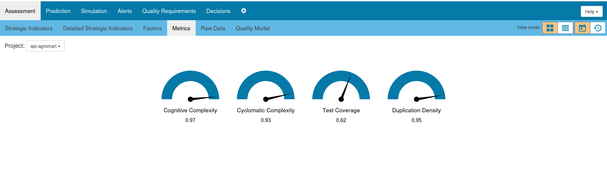
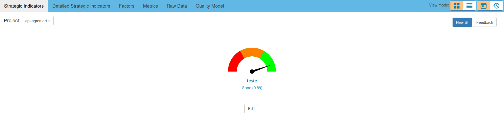

# Q-Rapids

O Q-Rapids é um framework desenvolvido no âmbito do projeto europeu H2020 para apoiar a tomada de decisões estratégicas em desenvolvimento ágil de software. Ele integra dados técnicos coletados de ferramentas como GitLab e SonarQube e os transforma em indicadores estratégicos, permitindo que decisões gerenciais sejam baseadas em evidências concretas de qualidade e desempenho dos projetos.

Neste projeto, configuramos o Q-Rapids para realizar a análise do código do AgroMart Mobile e da API. A execução do Q-Rapids foi feita com base nas instruções disponíveis no README do repositório do grupo, utilizando Docker Compose para iniciar os serviços necessários. Vale destacar que, nesta configuração, o Q-Rapids não foi integrado ao GitHub.

Com o objetivo de monitorar a qualidade do código e aspectos relacionados à manutenibilidade, foram selecionadas as seguintes métricas: 

- Cobertura de testes
- Densidade de duplicação de código 
- Complexidade ciclomática
- Complexidade cognitiva

## AgroMart Mobile

A seguir são apresentados os resultados obtidos para o AgroMart Mobile a partir da análise realizada com a ferramenta Q-Rapids:

- Cobertura de testes: 0,00
- Densidade de duplicação de código: 0,88
- Complexidade ciclomática: 0,84
- Complexidade cognitiva: 0,93
  

/// caption
Figura 1: Métricas do Q-Rapids (AgroMart Mobile Client)
///

O indicador estratégico de qualidade de código atingiu o valor de 0,74, sendo classificado como bom, de acordo com os critérios da ferramenta.

/// caption
Figura 2: Indicador Estratégico do Q-Rapids (AgroMart Mobile Client)
///

## AgroMart API

Os resultados da análise do AgroMart API, também com base na ferramenta Q-Rapids, foram os seguintes:

- Cobertura de testes: 0,62
- Densidade de duplicação de código: 0,95
- Complexidade ciclomática: 0,93
- Complexidade cognitiva: 0,97

/// caption
Figura 3: Métricas do Q-Rapids (AgroMart API)
///

O indicador estratégico de qualidade de código foi de 0,89, também classificado como bom.

/// caption
Figura 4: Indicador Estratégico do Q-Rapids (AgroMart API)
///

Apesar de ambos os sistemas apresentarem um bom indicador estratégico de qualidade de código segundo o Q-Rapids, a API obteve um desempenho superior (0,89) em relação ao Mobile (0,74). Essa diferença se deve principalmente à cobertura de testes, que é inexistente no Mobile (0,00) e razoável na API (0,62).

## Histórico de Versão

| Versão | Data       | Autor                                      | Descrição            | Revisor |
| ------ | ---------- | ------------------------------------------ | -------------------- | ------- |
| 1.0    | 07/07/2025 | [Cássio Reis](https://github.com/csreis72) | Criação do documento | -       |
