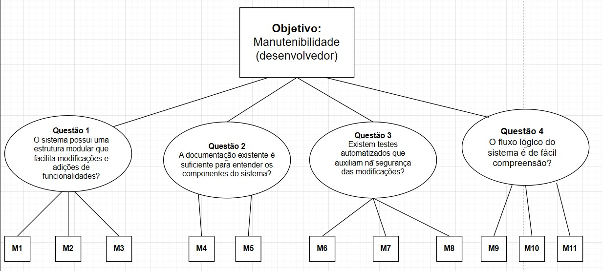
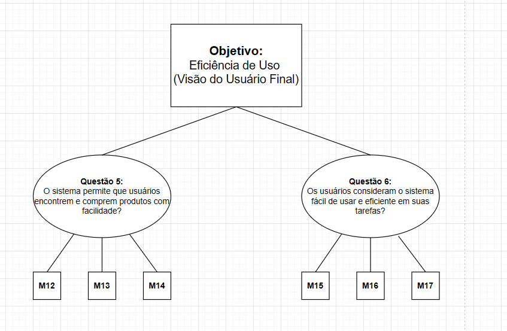

# GQM – Fase Definição

## Objetivo de negócio do AgroMart

O Agromart tem como propósito oferecer aos pequenos agricultores mais segurança no escoamento de sua produção, além de conectar consumidores que buscam uma alimentação saudável e de qualidade aos seus produtos.

---

## Objetivo de Medição 1

| Elemento                 | Descrição                                                                            |
| ------------------------ | ------------------------------------------------------------------------------------ |
| **Analisar**             | AgroMart                                                                             |
| **Para o propósito de**  | avaliar a sua capacidade de ser compreendido, adaptado e evoluído de forma eficiente |
| **Com respeito a**       | manutenibilidade                                                                     |
| **Do ponto de vista do** | desenvolvedor                                                                        |
| **No contexto da**       | disciplina de Qualidade de Software                                                  |

### Questões e Hipóteses

- **Q1:** O sistema possui uma estrutura modular que facilita modificações e adições de funcionalidades?  
  **Hipótese Q1:** O sistema apresenta uma estrutura modular com baixo acoplamento entre componentes, permitindo a realização de modificações e adições com impacto limitado e localizado.

- **Q2:** A documentação existente é suficiente para entender os componentes do sistema?  
  **Hipótese Q2:** A documentação cobre os principais componentes do sistema de forma clara e atualizada, com a presença de README, diagramas de arquitetura, comentários no código, entre outros, permitindo que desenvolvedores compreendam seu funcionamento sem depender de leitura extensiva do código.

- **Q3:** Existem testes automatizados que auxiliam na segurança das modificações?  
  **Hipótese Q3:** O sistema possui uma cobertura razoável de testes automatizados, o que contribui para a detecção de regressões e aumenta a confiança ao realizar modificações.

- **Q4:** O fluxo lógico do sistema é de fácil compreensão?  
  **Hipótese Q4:** O código possui baixa complexidade e está organizado de forma clara, facilitando o entendimento da lógica de execução pela equipe.

### Abstraction Sheet

<table style="width:100%; border-collapse: collapse;">
  <tr>
    <td style="width: 50%; padding: 10px; vertical-align: top; border: 1px solid #ccc;">
      <strong>Foco da Qualidade</strong>
      <ul style="margin-top: 5px;">
        <li>Cobertura de testes</li>
        <li>Grau de acoplamento entre módulos</li>
        <li>Cobertura da documentação</li>
        <li>Complexidade ciclomática</li>
      </ul>
    </td>
    <td style="width: 50%; padding: 10px; vertical-align: top; border: 1px solid #ccc;">
      <strong>Fatores de Variação</strong>
      <ul style="margin-top: 5px;">
        <li>Pressão por prazos de entrega</li>
        <li>Ausência de padrões arquiteturais e de codificação</li>
        <li>Comunicação informal e falta de discussão sobre decisões técnicas</li>
      </ul>
    </td>
  </tr>
  <tr>
    <td style="padding: 10px; vertical-align: top; border: 1px solid #ccc;">
      <strong>Hipótese de Baseline</strong>
      <ul style="margin-top: 5px;">
        <li>Cobertura de testes moderada a boa (entre 50% e 70%)</li>
        <li>Baixo a médio acoplamento</li>
        <li>Documentação cobre aspectos principais (como instalação e uso)</li>
        <li>Complexidade ciclomática média em nível aceitável (5–10 por função)</li>
      </ul>
    </td>
    <td style="padding: 10px; vertical-align: top; border: 1px solid #ccc;">
      <strong>Impacto dos Fatores de Variação</strong>
      <ul style="margin-top: 5px;">
        <li><em>Pressão por prazos de entrega:</em> menor cobertura de testes, maior acoplamento entre módulos, documentação técnica deficiente</li>
        <li><em>Ausência de padrões:</em> maior acoplamento e menor cobertura de testes</li>
        <li><em>Comunicação informal:</em> acoplamento elevado e documentação técnica incompleta</li>
      </ul>
    </td>
  </tr>
</table>

---

#### Métricas para Objetivo 1
###### M1: Grau de acoplamento
###### M2: Padrões arquiteturais
###### M3: Facilidade de extensão
###### M4: Cobertura da documentação
###### M5: Atualização da documentação
###### M6: Cobertura de testes
###### M7: Testes quebrados após mudanças
###### M8: Tempo p/ detectar falhas
###### M9: Complexidade ciclomática
###### M10: Comentários por função
###### M11: Tempo p/ entender módulo

## Objetivo de Medição 2

| Elemento                 | Descrição                                              |
| ------------------------ | ------------------------------------------------------ |
| **Analisar**             | AgroMart                                               |
| **Para o propósito de**  | entender sua eficácia e facilidade de uso              |
| **Com respeito a**       | eficiência de uso (usabilidade e desempenho percebido) |
| **Do ponto de vista de** | usuário final                                          |
| **No contexto da**       | disciplina de Qualidade de Software                    |

### Questões e Hipóteses

- **Q5:** O sistema permite que usuários encontrem e comprem produtos com facilidade?  
  **Hipótese Q5:** A interface é intuitiva e permite que os usuários realizem ações como busca, seleção e compra de produtos em poucos passos, com baixo índice de desistência.

- **Q6:** Os usuários consideram o sistema fácil de usar e eficiente em suas tarefas?  
  **Hipótese Q6:** Supõe-se que a maioria dos usuários perceba o sistema como fácil de usar, com baixa necessidade de suporte e altos níveis de satisfação, o que será validado por meio de pesquisas de usabilidade e coleta de feedback.

### Abstraction Sheet

<table style="width:100%; border-collapse: collapse;">
  <tr>
    <td style="width: 50%; padding: 10px; vertical-align: top; border: 1px solid #ccc;">
      <strong>Foco da Qualidade</strong>
      <ul style="margin-top: 5px;">
        <li>Taxa de sucesso em tarefas</li>
        <li>Tempo de execução da tarefa</li>
        <li>Desempenho percebido (tempo de resposta)</li>
        <li>Satisfação do usuário</li>
      </ul>
    </td>
    <td style="width: 50%; padding: 10px; vertical-align: top; border: 1px solid #ccc;">
      <strong>Fatores de Variação</strong>
      <ul style="margin-top: 5px;">
        <li>Experiência tecnológica dos usuários</li>
        <li>Qualidade do design da interface</li>
      </ul>
    </td>
  </tr>
  <tr>
    <td style="padding: 10px; vertical-align: top; border: 1px solid #ccc;">
      <strong>Hipótese de Baseline</strong>
      <ul style="margin-top: 5px;">
        <li>Taxa de sucesso ≥ 80%</li>
        <li>Tempo médio por tarefa &lt; 2 minutos</li>
        <li>Tempo de resposta percebido &lt; 1 segundo</li>
        <li>Satisfação média ≥ 4 (escala de 1 a 5)</li>
      </ul>
    </td>
    <td style="padding: 10px; vertical-align: top; border: 1px solid #ccc;">
      <strong>Impacto dos Fatores de Variação</strong>
      <ul style="margin-top: 5px;">
        <li><em>Usuários menos experientes:</em> menor taxa de sucesso e maior tempo por tarefa</li>
        <li><em>Interface mal projetada:</em> piora a percepção de desempenho e reduz a satisfação</li>
        <li><em>Design eficiente:</em> pode compensar baixa experiência dos usuários</li>
      </ul>
    </td>
  </tr>
</table>

---

#### Métricas para Objetivo 2
###### M12: Taxa de sucesso nas tarefas
###### M13: Cliques até compra
###### M14: Tempo médio de compra
###### M15: Satisfação média
###### M16: Tempo de resposta percebido
###### M17: Taxa de desistência

## Tabela de Contribuição

| Matrícula | Nome completo              | Contribuição (%) |
| --------- | -------------------------- | ---------------- |
| 221021886 | Cássio Sousa dos Reis      | 20%              |
| 180113097 | Daniel Coimbra dos Santos  | 20%              |
| 202023663 | Gabriel Basto Bertolazi    | 20%              |
| 221037803 | Letícia Kellen Ramos Paiva | 20%              |
| 170154319 | Philipe de Sousa Barros    | 20%              |

## Histórico de Versão

| Versão | Data       | Autor                                      | Descrição            | Revisor |
| ------ | ---------- | ------------------------------------------ | -------------------- | ------- |
| 1.0    | 26/05/2025 | [Cássio Reis](https://github.com/csreis72) | Criação do documento | [Daniel Coimbra](https://github.com/DanielCoimbra)       |
| 1.1    | 26/05/2025 | [Daniel Coimbra](https://github.com/DanielCoimbra) | Adição dos diagramas de Objetivo| -       |

