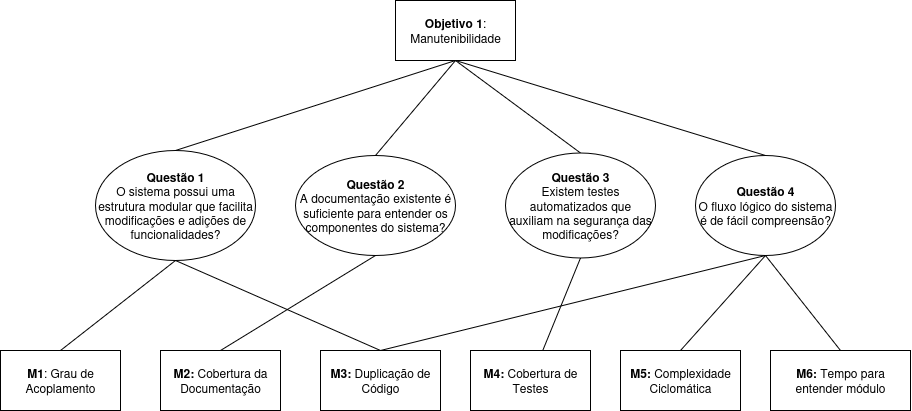
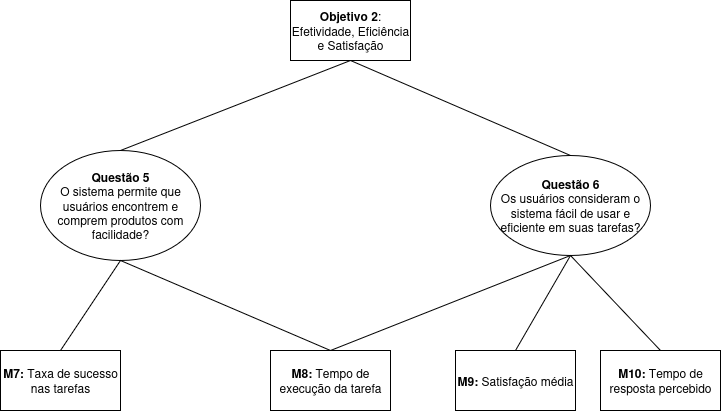

# GQM – Fase Definição

## Objetivo de negócio do AgroMart

O Agromart tem como propósito oferecer aos pequenos agricultores mais segurança no escoamento de sua produção, além de conectar consumidores que buscam uma alimentação saudável e de qualidade aos seus produtos.

---

## Objetivo de Medição 1

| Elemento                 | Descrição                           |
| ------------------------ | ----------------------------------- |
| **Analisar**             | AgroMart                            |
| **Para o propósito de**  | avaliar                             |
| **Com respeito a**       | manutenibilidade                    |
| **Do ponto de vista do** | desenvolvedor                       |
| **No contexto da**       | disciplina de Qualidade de Software |

### Questões e Hipóteses

- **Q1:** O sistema possui uma estrutura modular que facilita modificações e adições de funcionalidades?  
  **Hipótese Q1:** O sistema apresenta uma estrutura modular com baixo acoplamento entre componentes, permitindo a realização de modificações e adições com impacto limitado e localizado.

- **Q2:** A documentação existente é suficiente para entender os componentes do sistema?  
  **Hipótese Q2:** A documentação cobre os principais componentes do sistema de forma clara e atualizada, com a presença de README, diagramas de arquitetura, comentários no código, entre outros, permitindo que desenvolvedores compreendam seu funcionamento sem depender de leitura extensiva do código.

- **Q3:** Existem testes automatizados que auxiliam na segurança das modificações?  
  **Hipótese Q3:** O sistema possui uma cobertura razoável de testes automatizados, o que contribui para a detecção de regressões e aumenta a confiança ao realizar modificações.

- **Q4:** O fluxo lógico do sistema é de fácil compreensão?  
  **Hipótese Q4:** O código possui baixa complexidade e está organizado de forma clara, facilitando o entendimento da lógica de execução pela equipe.

### Abstraction Sheet

<table style="width:100%; border-collapse: collapse;">
  <tr>
    <td style="width: 50%; padding: 10px; vertical-align: top; border: 1px solid #ccc;">
      <strong>Foco da Qualidade</strong>
      <ul style="margin-top: 5px;">
        <li>Grau de acoplamento entre módulos</li>
        <li>Cobertura da documentação</li>
        <li>Cobertura de testes</li>
        <li>Duplicação de código</li>
        <li>Complexidade ciclomática</li>
        <li>Tempo para entender módulo</li>
      </ul>
    </td>
    <td style="width: 50%; padding: 10px; vertical-align: top; border: 1px solid #ccc;">
      <strong>Fatores de Variação</strong>
      <ul style="margin-top: 5px;">
        <li>Pressão por prazos de entrega</li>
        <li>Ausência de padrões arquiteturais e de codificação</li>
        <li>Comunicação informal e falta de discussão sobre decisões técnicas</li>
      </ul>
    </td>
  </tr>
  <tr>
    <td style="padding: 10px; vertical-align: top; border: 1px solid #ccc;">
      <strong>Hipótese de Baseline</strong>
      <ul style="margin-top: 5px;">
        <li>Cobertura de testes moderada a boa (entre 50% e 70%)</li>
        <li>
          Baixo a médio acoplamento - entre 70% e 90% dos módulos possuem
          <ul>
            <li>AC (Afferent Coupling) entre 3 e 7 módulos/componentes que dependem deste módulo</li>
            <li>EC (Efferent Coupling) entre 3 e 7 módulos/componentes dos quais este módulo depende</li>
            <li>I (Instability) entre 0,2 e 0,6, garantindo equilíbrio entre estabilidade e flexibilidade</li>
          </ul>
        </li>
        <li>Cobertura da Documentação - Densidade de comentários entre 15% e 25%, indicando documentação suficiente para orientar novos desenvolvedores</li>
        <li>Complexidade ciclomática média em nível aceitável (5–10 por função)</li>
        <li>Tempo médio para entender módulo: entre 5 e 10 minutos</li>
        <li>Duplicação de código abaixo de 5%</li>
      </ul>
    </td>
    <td style="padding: 10px; vertical-align: top; border: 1px solid #ccc;">
      <strong>Impacto dos Fatores de Variação</strong>
      <ul style="margin-top: 5px;">
        <li><em>Pressão por prazos de entrega:</em> menor cobertura de testes, maior acoplamento entre módulos, documentação técnica deficiente, aumento da duplicação de código e da complexidade cognitiva</li>
        <li><em>Ausência de padrões:</em> maior acoplamento, menor cobertura de testes, maior duplicação de código e lógica redundante</li>
        <li><em>Comunicação informal:</em> acoplamento elevado, documentação técnica incompleta, decisões de implementação inconsistentes e maior complexidade cognitiva</li>
      </ul>
    </td>
  </tr>
</table>

---

#### Métricas para Objetivo 1

###### M1: Grau de acoplamento

###### M2: Cobertura da documentação

###### M3: Duplicação de Código

###### M4: Cobertura de testes

###### M5: Complexidade ciclomática

###### M6: Tempo para entender módulo

## Objetivo de Medição 2

| Elemento                 | Descrição                                       |
| ------------------------ | ----------------------------------------------- |
| **Analisar**             | AgroMart                                        |
| **Para o propósito de**  | entender                                        |
| **Com respeito a**       | efetividade, eficiência e satisfação do usuário |
| **Do ponto de vista de** | usuário final                                   |
| **No contexto da**       | disciplina de Qualidade de Software             |

### Questões e Hipóteses

- **Q5:** O sistema permite que usuários encontrem e comprem produtos com facilidade?  
  **Hipótese Q5:** A interface é intuitiva e permite que os usuários realizem ações como busca, seleção e compra de produtos em poucos passos, com baixo índice de desistência.

- **Q6:** Os usuários consideram o sistema fácil de usar e eficiente em suas tarefas?  
  **Hipótese Q6:** Supõe-se que a maioria dos usuários perceba o sistema como fácil de usar, com baixa necessidade de suporte e altos níveis de satisfação, o que será validado por meio de pesquisas de usabilidade e coleta de feedback.

### Abstraction Sheet

<table style="width:100%; border-collapse: collapse;">
  <tr>
    <td style="width: 50%; padding: 10px; vertical-align: top; border: 1px solid #ccc;">
      <strong>Foco da Qualidade</strong>
      <ul style="margin-top: 5px;">
        <li>Taxa de sucesso em tarefas</li>
        <li>Tempo de execução da tarefa</li>
        <li>Desempenho percebido (tempo de resposta)</li>
        <li>Satisfação do usuário</li>
      </ul>
    </td>
    <td style="width: 50%; padding: 10px; vertical-align: top; border: 1px solid #ccc;">
      <strong>Fatores de Variação</strong>
      <ul style="margin-top: 5px;">
        <li>Experiência tecnológica dos usuários</li>
        <li>Qualidade do design da interface</li>
      </ul>
    </td>
  </tr>
  <tr>
    <td style="padding: 10px; vertical-align: top; border: 1px solid #ccc;">
      <strong>Hipótese de Baseline</strong>
      <ul style="margin-top: 5px;">
        <li>Taxa de sucesso ≥ 80%</li>
        <li>Tempo médio por tarefa &lt; 2 minutos</li>
        <li>Tempo de resposta percebido &lt; 1 segundo</li>
        <li>Satisfação média ≥ 4 (escala de 1 a 5)</li>
      </ul>
    </td>
    <td style="padding: 10px; vertical-align: top; border: 1px solid #ccc;">
      <strong>Impacto dos Fatores de Variação</strong>
      <ul style="margin-top: 5px;">
        <li><em>Usuários menos experientes:</em> menor taxa de sucesso e maior tempo por tarefa</li>
        <li><em>Interface mal projetada:</em> piora a percepção de desempenho e reduz a satisfação</li>
        <li><em>Design eficiente:</em> pode compensar baixa experiência dos usuários</li>
      </ul>
    </td>
  </tr>
</table>

---

#### Métricas para Objetivo 2

###### M7: Taxa de sucesso nas tarefas

###### M8: Tempo de execução da tarefa

###### M9: Satisfação média

###### M10: Tempo de resposta percebido

## Tabela de Contribuição

| Matrícula | Nome completo              | Contribuição (%) |
| --------- | -------------------------- | ---------------- |
| 221021886 | Cássio Sousa dos Reis      | 20%              |
| 180113097 | Daniel Coimbra dos Santos  | 20%              |
| 202023663 | Gabriel Basto Bertolazi    | 20%              |
| 221037803 | Letícia Kellen Ramos Paiva | 20%              |
| 170154319 | Philipe de Sousa Barros    | 20%              |

  
<strong>Changelog v1.2 GQM (05/07/2025)</strong>

  
Algumas métricas de manutenibilidade inicialmente consideradas foram descartadas. Abaixo estão os principais motivos:

  <ul>
    <li><strong>Facilidade de extensão</strong> 
      Métrica subjetiva e difícil de quantificar sem envolvimento direto dos desenvolvedores originais. Seria mais adequada em estudos observacionais ou entrevistas.
    </li>
    <li><strong>Testes quebrados após mudanças</strong> 
      Exige execução contínua de testes automatizados em múltiplos commits, o que não é possível sem histórico e pipeline ativo de CI.
    </li>
    <li><strong>Tempo para detectar falhas</strong> 
      Depende de logs históricos de bugs ou dados operacionais de produção, que não estão disponíveis para a equipe avaliadora.
    </li>
    <li><strong>Padrões arquiteturais</strong> 
      A avaliação de padrões arquiteturais exige análise qualitativa e conhecimento profundo do sistema e suas decisões de design, o que foge ao escopo da análise automatizada e objetiva.
    </li>
  </ul>

## Histórico de Versão

| Versão | Data       | Autor                                              | Descrição                                | Revisor                                            |
| ------ | ---------- | -------------------------------------------------- | ---------------------------------------- | -------------------------------------------------- |
| 1.0    | 26/05/2025 | [Cássio Reis](https://github.com/csreis72)         | Criação do documento                     | [Daniel Coimbra](https://github.com/DanielCoimbra) |
| 1.1    | 26/05/2025 | [Daniel Coimbra](https://github.com/DanielCoimbra) | Adição dos diagramas de Objetivo         | -                                                  |
| 1.2    | 05/07/2025 | [Cássio Reis](https://github.com/csreis72)         | Revisão das métricas de manutenibilidade | -                                                  |
