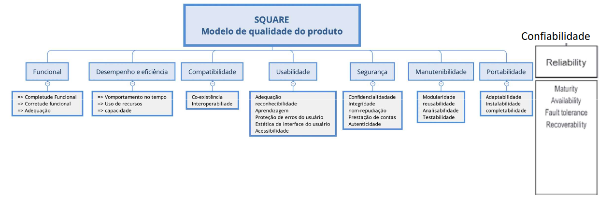
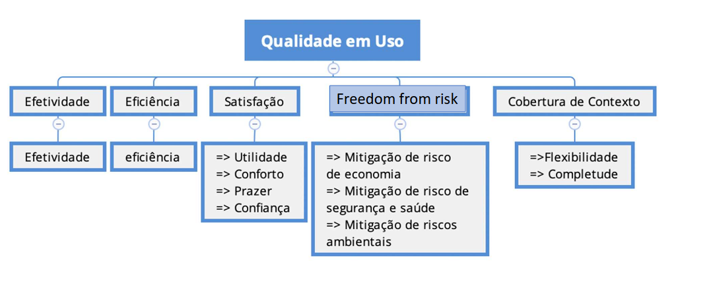

# Fase 1: Estabelecer Requisitos de Avaliação

## 1. Selecionar o Software

**Software a ser analisado:** AgroMart - Mobile

O AgroMart é um software desenvolvido na UnB-FCTE (Universidade de Brasília - Faculdade de Ciências e Tecnologias em Engenharia) que inclui uma aplicação web para agricultores e um aplicativo móvel multiplataforma para consumidores. Nesta avaliação, o foco será no aplicativo móvel do AgroMart, que permite aos consumidores acessar, selecionar e adquirir cestas agroecológicas por meio de comunidades de agricultura sustentável (CSA).

### Características principais da análise:

A avaliação será feita com base nos modelos de qualidade de produto e de qualidade em uso definidos pela ISO/IEC 25010, que trazem características importantes para medir como um software atende às necessidades dos usuários e às exigências técnicas.

- **Manutenibilidade**: Facilidade e efetividade de custo para modificar, atualizar, consertar ou aperfeiçoar o software após sua entrega.  
  **Ênfase:** 5

- **Efetividade**: Capacidade do sistema de permitir que os usuários atinjam objetivos específicos com precisão e completude.  
  **Ênfase**: 2

- **Eficiência**: Refere-se aos recursos utilizados em relação à precisão e completude com que os usuários alcançam os objetivos.  
  **Ênfase**: 2

- **Satisfação**: Grau de conforto, aceitação e bem-estar dos usuários ao interagir com o sistema.  
  **Ênfase**: 2

**Escala de Interesse:**

1 – Nenhum interesse  
2 – Baixo interesse  
3 – Médio interesse  
4 – Largo interesse  
5 – Grande interesse

---

## 2. Descrever o Propósito da Avaliação

A avaliação servirá para:

- Identificar os pontos fortes e fracos da solução de software  
  _Ex: métricas que o software se destaca ou deixa a desejar_

- Aperfeiçoar a Qualidade do Software  
  _Ex: otimização do código, melhorar práticas de desenvolvimento, etc._

- Aumentar o nível de Satisfação do Usuário  
  _Ex: aumentar captação e retenção de usuários, diminuir erros e bugs no sistema_

---

## 3. Identificar o tipo de produto

### 3.1. Funções

O AgroMart possui um conjunto extenso de funções. Suas principais funções incluem:

- Cadastro e autenticação de usuários.
- Gerenciamento de lojas, produtos, planos e cestas (painel web).
- Gerenciamento de assinantes (co-agricultores) e usuários.
- Visualização e gerenciamento de pedidos.
- Notificações para usuários.
- Visualização e busca de lojas (app móvel).
- Visualização de produtos, preços e detalhes das lojas.
- Contato direto com vendedores via link.
- Realização e histórico de pedidos.
- Gerenciamento de planos assinados e endereços (app móvel).
- Edição de perfil do usuário (app móvel).

### 3.2. Principais usuários

Os principais usuários são pequenos agricultores/produtores, usuários da interface web, e os consumidores finais interessados em alimentos saudáveis, usuários do aplicativo móvel.

### 3.3. Ambiente no qual o produto será inserido

- Ambiente urbano e rural, com foco na agricultura familiar
- Usuários com acesso à internet, usando smartphones ou computadores
- Provavelmente ambientes com conectividade limitada em alguns casos (zona rural), o que exige usabilidade e performance

### 3.4. Nível de conhecimento exigido dos usuários em relação à informática

- **Agricultores**: Nível básico a intermediário - uso de sistemas de cadastro, edição de produtos e navegação por painéis administrativos
- **Consumidores**: Nível básico - uso simples de app com funções comuns de localização e compra

### 3.5. Principais componentes do produto que serão submetidos à avaliação

A avaliação focará no aplicativo móvel do AgroMart (Mobile Client).
### 3.6. Requisitos de hardware e software para executar o produto de software

Requisitos para desenvolvimento local (Web e API):

- Node.js: versão entre 10.16.0 e 14.x.x
- Yarn
- Docker e Docker Compose para o banco de dados PostgreSQL
- Strapi CMS
- Navegador moderno (Chrome, Firefox)

Requisitos para o App Mobile:

- React Native com TypeScript
- Expo CLI instalado
- Smartphone com Android (ou emulador)
- Conectividade com a API backend

Hardware mínimo recomendado:

- Para desenvolvedores: Computador com pelo menos 8GB RAM, 4 núcleos de CPU, suporte a virtualização (para Docker)
- Para usuários finais (app): Smartphone com Android 7.0 ou superior, conexão à internet

---

## 4. Especificar o modelo de qualidade

Para a avaliação do AgroMart, foram adotados os modelos de qualidade de produto e qualidade em uso, conforme definidos pela norma ISO/IEC 25010 (SQuaRE). Esses modelos fornecem uma estrutura abrangente para avaliar as características do sistema, tanto do ponto de vista do produto em si quanto da experiência do usuário durante seu uso.

/// caption
Figura 1: Modelo de Qualidade de Produto (SQuaRE)
///

/// caption
Figura 2: Modelo de Qualidade em Uso (SQuaRE)
///

---

## 5. ODS - Objetivos de Desenvolvimento Sustentável

O **AgroMart** alinha-se a diversos ODS da Agenda 2030 da ONU:

- **ODS 2 – Fome Zero e Agricultura Sustentável**  
  Facilita a conexão entre pequenos produtores e consumidores, promovendo o acesso a alimentos saudáveis e fortalecendo práticas agrícolas sustentáveis.

- **ODS 8 – Trabalho Decente e Crescimento Econômico**  
  Contribui para a geração de renda e a valorização do trabalho na agricultura familiar, incentivando o empreendedorismo rural.

- **ODS 9 – Indústria, Inovação e Infraestrutura**  
  Demonstra como a inovação pode ser aplicada para melhorar a infraestrutura de comercialização no setor agrícola.

- **ODS 12 – Consumo e Produção Responsáveis**  
  Promove a venda direta de produtos agroecológicos, incentivando práticas de consumo consciente e reduzindo intermediários na cadeia de abastecimento.

- **ODS 13 – Ação Contra a Mudança Global do Clima**  
  Apoia a agricultura local e sustentável, contribuindo para a redução da pegada de carbono associada ao transporte e à produção intensiva de alimentos.

---

## Links

- [Repositório no GitHub - AgroMart](https://github.com/AgroMart)

## Tabela de Contribuição

| Matrícula | Nome completo              | Contribuição (%) |
| --------- | -------------------------- | ---------------- |
| 221021886 | Cássio Sousa dos Reis      | 20%              |
| 180113097 | Daniel Coimbra dos Santos  | 20%              |
| 202023663 | Gabriel Basto Bertolazi    | 20%              |
| 221037803 | Letícia Kellen Ramos Paiva | 20%              |
| 170154319 | Philipe de Sousa Barros    | 20%              |

  
<strong>Changelog v1.2 Fase 1 (07/07/2025)</strong>

   <ul>
    <li>
      A característica de qualidade <strong>Usabilidade</strong> foi substituída por <strong>Efetividade</strong>, <strong>Eficiência</strong> e <strong>Satisfação</strong>, para garantir alinhamento conceitual com o modelo de qualidade em uso da ISO/IEC 25010. As métricas adotadas na avaliação estavam diretamente relacionadas a essas características, e não à usabilidade, que pertence ao modelo de qualidade do produto.
    </li>
    <li>
     Adição do tópico "Identificar o tipo de produto"
    </li>
  </ul>

## Histórico de Versão

| Versão | Data       | Autor                                            | Descrição                                                                                | Revisor     |
| ------ | ---------- | ------------------------------------------------ | ---------------------------------------------------------------------------------------- | ----------- |
| 1.0    | 26/05/2025 | [Philipe Sousa](https://github.com/PhilipeSousa) | Criação do documento                                                                     | Cássio Reis |
| 1.1    | 28/05/2025 | [Cássio Reis](https://github.com/csreis72)       | Adição de informações sobre o software e modelo de qualidade escolhidos                  | -           |
| 1.2    | 07/07/2025 | [Cássio Reis](https://github.com/csreis72)       | Adição do tópico "Identificar o tipo de produto" e revisão das características definidas | -           |
